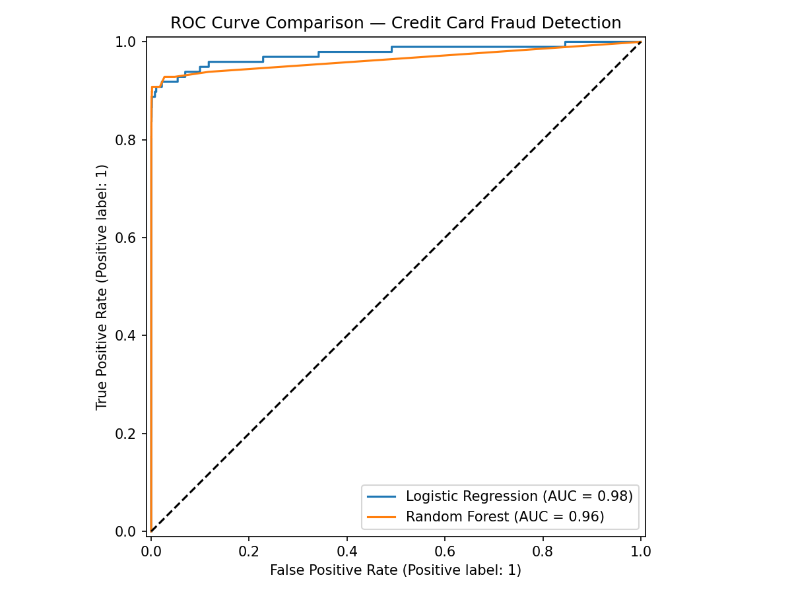
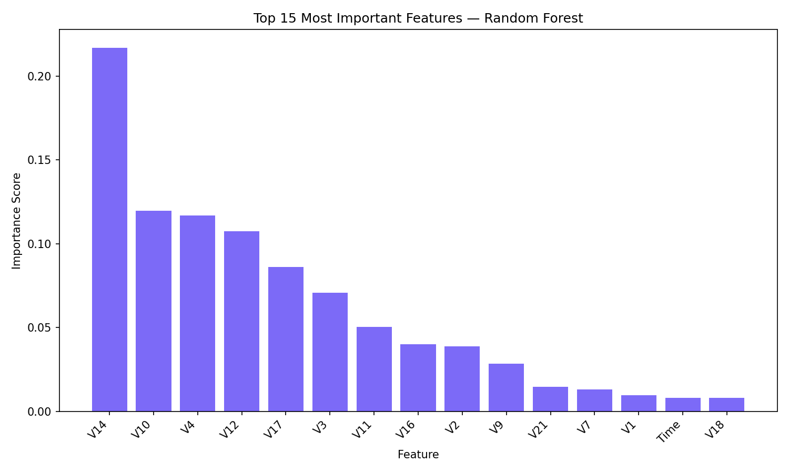

# Credit Card Fraud Detection 🔍

ML model to detect fraudulent credit card transactions on a massively imbalanced dataset.

## 📊 Results

| Model | Fraud Recall | Fraud Precision | AUC-ROC |
|---|---|---|---|
| Logistic Regression | 90% | 13% | 0.9765 |
| Random Forest | 83% | 84% | 0.9644 |

**Winner: Random Forest** — better balance between catching fraud and avoiding false alarms.

## 🧠 The Core Problem

492 fraud cases out of 284,807 transactions = **0.17% fraud rate**.

A model that always predicts "Normal" would get 99.8% accuracy — completely useless.
Standard accuracy is the wrong metric here. We need **Recall** and **AUC-ROC**.

## ⚙️ Approach

1. **Exploratory Data Analysis** — understanding data shape, distributions, imbalance
2. **SMOTE** — Synthetic Minority Oversampling to balance classes (394 → 227,451 fraud samples)
3. **Model Training** — Logistic Regression vs Random Forest
4. **Evaluation** — Precision, Recall, F1-Score, AUC-ROC, Confusion Matrix
5. **Feature Importance** — which features matter most for fraud detection

## 🛠 Tech Stack

Python · Scikit-learn · imbalanced-learn · Pandas · NumPy · Matplotlib · Seaborn · Joblib

## 📊 Visualizations

